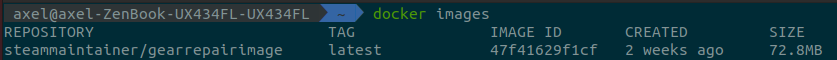

# Peel back the layers (Forensics)

In this challenge the only thing we get is a docker image. 

We first need to pull the image:

```
docker pull steammaintainer/gearrepairimage
```

We can now get the image id: 




With the image id we want to save the image to a .tar file since the tar file will contain all the layers of the image which is what the title of the challenge hints towards.Each layer corresponds to a certain instruction in the docker file. Files can therefore have been deleted in the newer layer that is visible to the user. 

```
docker save -o layers.tar 47f41629f1cf
```

If we now grep for the flag recursively we find a few files including the the desired file that contains the actual flag: 

```
grep -r "HTB"

Binary file 011c8322f085501548c8d04da497c2d7199f9599e9c02b13edd7a8bbb0f8ee77/usr/share/lib/librs.so matches
```

We then run strings on this file to get all printable strings:  
```
strings 011c8322f085501548c8d04da497c2d7199f9599e9c02b13edd7a8bbb0f8ee77/usr/share/lib/librs.so

libc.so.6
GLIBC_2.2.5
u/UH
HTB{1_r3H
4lly_l1kH
3_st34mpH
unk_r0b0H
ts!!!}
REMOTE_ADDR
REMOTE_PORT
/bin/sh
```

And there is our flag:

```
HTB{1_r34lly_l1k3_st34mpunk_r0b0ts!!!}
```