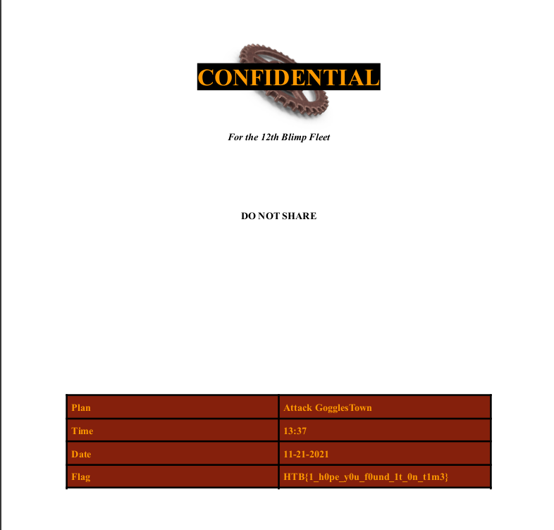

## Strike back (Forensics)

So, in this challenge we get a pcap file and a dmp file. 

We first extract all the files from freesteam.dmp using binwalk: 

```
binwalk --dd=".*" freesteam.dmp
```

We get a lot of files, but the pdf file seems especially interesting. In fact if we open it up it gives us the flag. 



```
HTB{1_h0pe_y0u_f0und_1t_0n_t1m3}
```

We solved this one quite fast, despite the 2 star rating. However this was probably not the intended solution since we only used one of the two files given.  