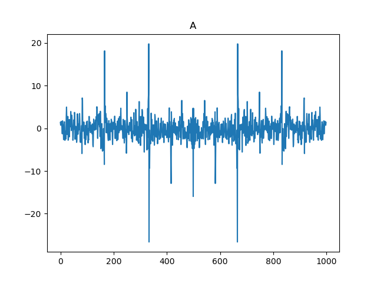
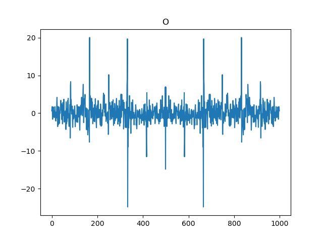
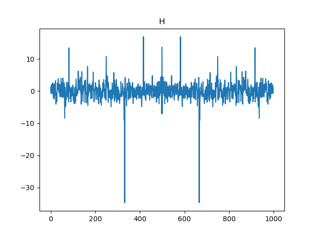
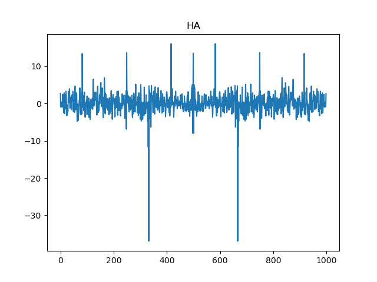
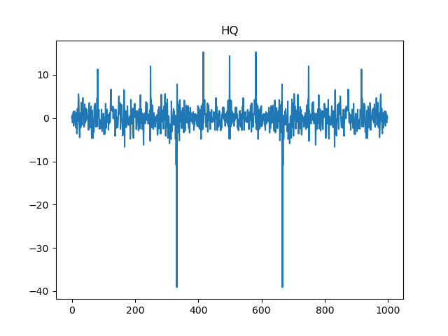
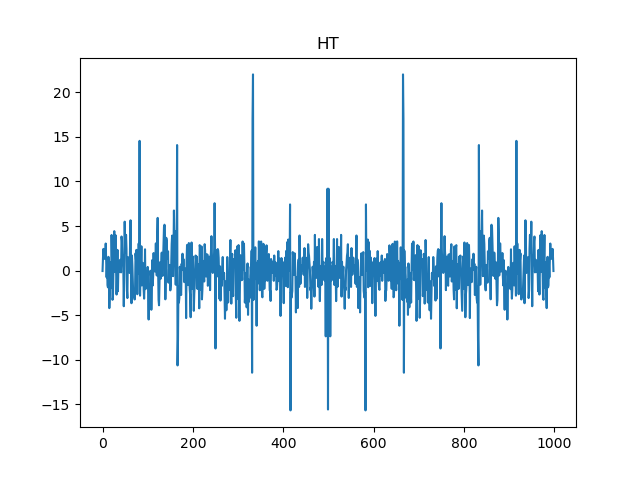

# Out of time (Hardware)

In this challenge we get a service that asks for a password and returns an array of 1000 numbers depending on the given password. These numbers are a bit different each time we submit the password, even if the same password is provided. 

We know that HTB{ should be the first part of the password. It's therefore good to analyze the difference between two signals where we know that a letter is correct in one of them and incorrect in the other one. To do this we decided to use fast fourier transform, this makes the differences clearer. 

Here we have 3 results from guessing the passwords A, O and H. Using fft on the array we get from guessing on these passwords. 





We can clearly see that something is going on with the H. This is good since it's the first letter of the flag. Continuing doing this we get the following.





We can use the following python script to extract the flag. 

```python
import time
import socket
import base64
import numpy as np
import string
import time
from tqdm import tqdm
import matplotlib.pyplot as plt


HOST = '167.172.57.19' # This must be changed to the corresponding value of the live instance
PORT = 30585  # This must be changed to the corresponding value of the live instance

# This function is used to decode the base64 transmitted power trace (which is a NumPy array)
def b64_decode_trace(leakage):
	byte_data = base64.b64decode(leakage) # decode base64
	return np.frombuffer(byte_data) # convert binary data into a NumPy array

def connect_to_socket(option, data):
	data = data.encode()
	with socket.socket(socket.AF_INET, socket.SOCK_STREAM) as s:
		s.connect((HOST, PORT))
		resp_1 = s.recv(1024)
		s.sendall(option) 	
		resp_2 = s.recv(1024)
		s.sendall(data) 

		resp_data = b''
		tmp = s.recv(8096)
		while tmp != b'':
			resp_data += tmp
			tmp = s.recv(8096)
		s.close()

		return resp_data

def get_power_trace(password_guess):
	leakage = connect_to_socket(b'1', password_guess)
	power_trace = b64_decode_trace(leakage)
	return power_trace

def solve(password_guess):
	best = -10000
	best_c = ""
	p0 = np.fft.fft(get_power_trace(password_guess+"%"))[1:].real
	for c in tqdm(string.printable):
		p1 = np.fft.fft(get_power_trace(password_guess+c))[1:].real
		val = ((p1-p0)**2).mean().real
		if (val > best):
			best = val
			best_c = c

	return password_guess+best_c


password_guess = ""

for i in range(100):
	password_guess = solve(password_guess)
	print (password_guess)
```

What this does is fist guessing on "%" which we assume wont be a part of the flag. We then get the square mean of the difference between this and our next guess. We then pick the one with the greatest value. This will result in extracting the character that results in the greatest difference compared to all the other ones. After doing this for a few iterations we get the flag. 

```
HTB{c4n7_h1d3_f20m_71m3} 
```