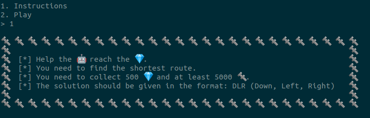
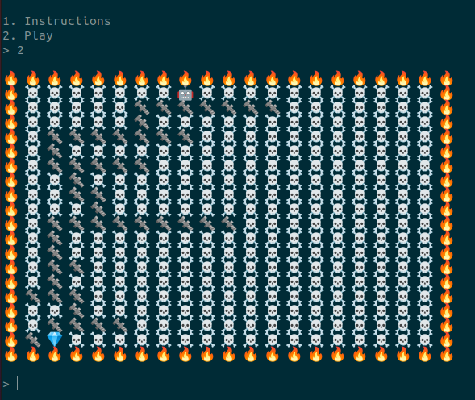

# Insane Bolt (Misc)

When we connect to the docker instance we get two options: 

Viewing the instructions: 



And playing the game: 



So, we need to find the shortest path in this grid and complete 500 levels moving only down, left or right. We can solve this using bfs, constantly remembering the positions we have visited. Since we are looking for the shortest path we don't want to visit any position twice. We also keep track of all the previous moves. 

The following code parses the grid, assigning new strings to each position (we don't want to deal with emojis). We then call the bfs function on this grid with the initial position of the robot. We keep doing this 500 times until we finally get the flag.  

```python
from pwn import *
import sys

sys.setrecursionlimit(10000000)

host = "167.172.51.173"
port = 30917

p = remote(host, port)

def bfs(x, y, map, path, seen):
    if (str(x)+str(y) in seen):
        return (0, "")

    seen[str(x)+str(y)] = 1

    if (map[y][x] == 'diamond'):
        return (1, path)

    if (map[y+1][x] != 'fire' and map[y+1][x] != 'death'):
        ret = bfs(x, y+1, map, path+'D', seen)
        if (ret[0] == 1):
            return ret
    if (map[y][x-1] != 'fire' and map[y][x-1] != 'death'):
        ret = bfs(x-1, y, map, path+'L', seen)
        if (ret[0] == 1):
            return ret
    if (map[y][x+1] != 'fire' and map[y][x+1] != 'death'):
        ret = bfs(x+1, y, map, path+'R', seen)
        if (ret[0] == 1):
            return ret
    
    return (0, "")

def solve(map_str): 
    mp = map_str.split(b" ")
    map = []
    
    row = []
    for i in range(len(mp)): 
        if (b'\n' in mp[i]):
            if (len(row) > 0):
                map.append([i for i in row])
                row = []
        elif (b'\xf0\x9f\x94\xa5' in mp[i]):
            row.append("fire")
        elif (b'\xe2\x98\xa0\xef\xb8\x8f' in mp[i]):
            row.append("death")
        elif (b'\xf0\x9f\xa4\x96' in mp[i]):
            row.append("robot")
        elif (b'\xf0\x9f\x94\xa9' in mp[i]):
            row.append("bolt")
        elif (b'\xf0\x9f\x92\x8e' in mp[i]):
            row.append("diamond")
    
    for y in range(len(map)):
        for x in range(len(map[y])):
            if (map[y][x] == 'robot'):
                return bfs(x, y, map, "", {})[1]


p.recvuntil('>')
p.sendline('2')

for i in range(500):
    map = p.recvuntil('>')
    sol = solve(map)
    p.sendline(sol)
    a = p.recvline()
    b = p.recvline()
    print (a, b)
p.interactive()
```

We finally get the flag: 
```
HTB{w1th_4ll_th353_b0lt5_4nd_g3m5_1ll_cr4ft_th3_b35t_t00ls}
```