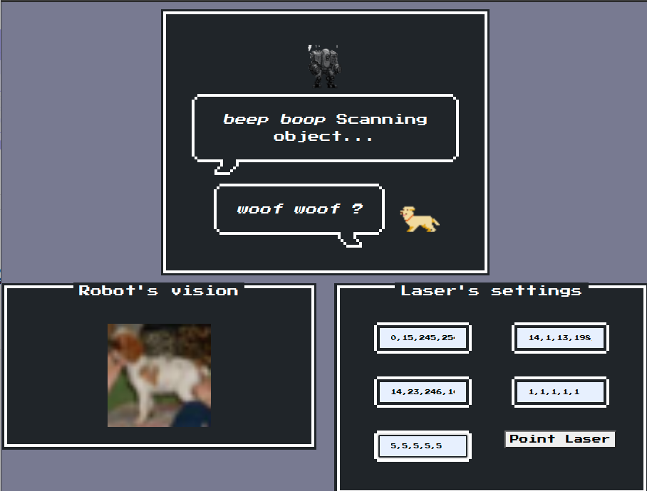
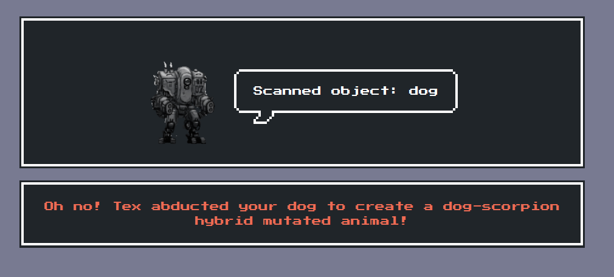
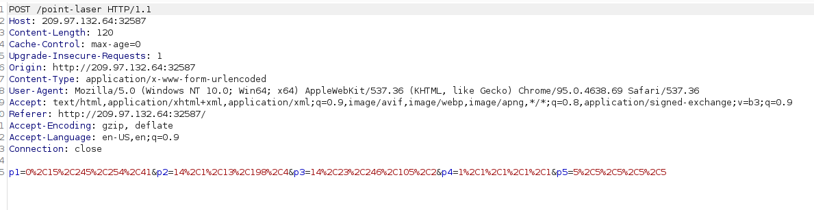
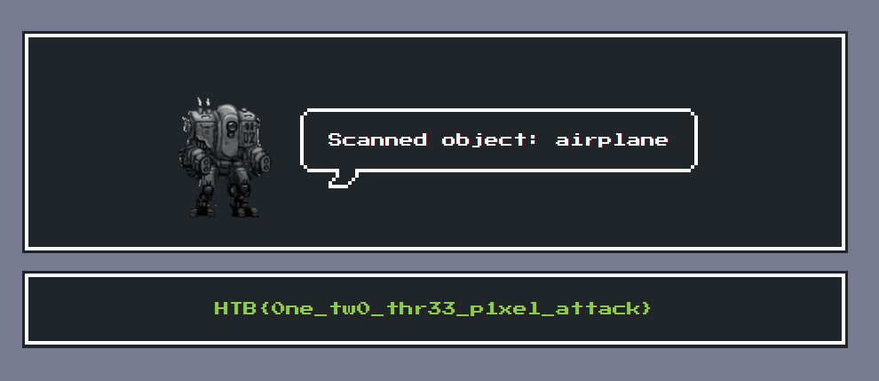
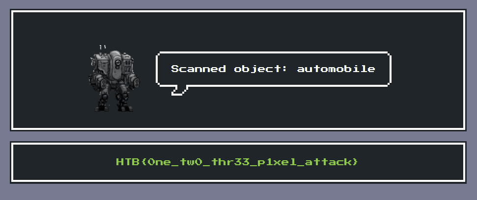

# Sigma Technology (Misc)

In this challenge we get a model that labels an image based on 10 categories. Our goal is to modify pixels in an image of a dog
to make the model classify the image as a vehicle instead. 



If we just modify points randomly we get the following result: 



It was unfortunately at this point we went the wrong way during the competition. We will therefore divide the solution into two parts: the reasonable way and the way we did it during the competition. 

### The reasonable way

When submitting the pixels we want to modify we send the following request to the server: 



We can simply try to add another point to this request, allowing us to modify more than 5 points. Since this seemed to work we can try downsampling a picture of an airplane to the same size as the image of the dog (32*32). Modify all of the pixels in the original image to the ones in the airplane picture. 

We used https://resizeimage.net/ to downsample the image of the plane. This could also be done in python. We then used the following to create our payload: 

```python
from PIL import Image
img = Image.open('downsampled_plane.jpg')
pix = img.load()

i = 1
s = ""
for y in range(32):
    for x in range(32):
        s += f"p{i}={x}%2C{y}%2C{pix[x, y][0]}%2C{pix[x, y][1]}%2C{pix[x, y][2]}&"
        i += 1

print(s)
```

We then get the following string that gives us the flag when the request is modified in burp suite. 

```
p1=0%2C0%2C70%2C178%2C250&p2=1%2C0%2C74%2C178%2C251&p3=2%2C0%2C78%2C178%2C253&p4=3%2C0%2C79%2C180%2C252&p5=4%2C0%2C80%2C181%2C253&p6=5%2C0%2C79%2C182%2C251&p7=6%2C0%2C82%2C183%2C251&p8=7%2C0%2C87%2C184%2C253&p9=8%2C0%2C87%2C184%2C252&p10=9%2C0%2C88%2C185%2C253&p11=10%2C0%2C85%2C184%2C252&p12=11%2C0%2C82%2C183%2C253&p13=12%2C0%2C81%2C182%2C252&p14=13%2C0%2C79%2C181%2C253&

...

p1019=26%2C31%2C63%2C174%2C246&p1020=27%2C31%2C59%2C173%2C244&p1021=28%2C31%2C54%2C170%2C243&p1022=29%2C31%2C51%2C169%2C243&p1023=30%2C31%2C47%2C167%2C243&p1024=31%2C31%2C46%2C166%2C242
```

Result from modifying the request with the points above: 



And we get the flag: 
```
HTB{0ne_tw0_thr33_p1xel_attack}
```

### What we did during the competition

During the competition we thought that it was actually possible to modify only 5 pixels to make the model classify the image as a vehicle. 

Our first approach was to just randomly picking 5 pixels, modify them randomly and then evaluating the result. Repeating this until the result was something other than a dog. This did in some ways work, we managed to get it to classify the image as a horse, but never any vehicle. 

Our next approach was to get the gradient of the model. Pick the 5 pixels with the highest values. Modify these in the opposite direction of the gradient until the final image was classified as a vehicle. 

Function to get the gradient: 

```python
import tensorflow as tf
from tensorflow.keras.metrics import categorical_crossentropy
from tensorflow.keras import models, losses 

model = SigmaNet()

def get_gradient(im):
  model_wrapper = models.Model([model._model.inputs],[model._model.output])
  color_processed_img = model.color_process(im)
  img = tf.Variable(tf.convert_to_tensor(color_processed_img))
  y = np.expand_dims(np.array([0,1,0,0,0,0,0,0,0,0]), axis=0)
  with tf.GradientTape() as tape:
      tape.watch(img)
      predictions = model_wrapper(img)
      loss = categorical_crossentropy(y, predictions)

  grads = tape.gradient(loss, img)
  return grads
```

Moving in the direction of the gradient: 

```python
im = imageio.imread('dog.png')[:,:,:3]
grads = get_gradient(im)[0]

changed_pixels = 20
top_pix = np.argsort(np.sum(grads**2, axis=2).flatten())[::-1][:changed_pixels]

y_top = top_pix//32
x_top = top_pix%32

y = y_top
x = x_top

H = 255
for q in range(H):
  grads = get_gradient(im)[0]
  for i in range(changed_pixels):
    for j in range(3): 
      if (grads[y[i]][x[i]][j] > 0):
        im[y[i]][x[i]][j] -= 1
      elif (grads[y[i]][x[i]][j] < 0):
        im[y[i]][x[i]][j] += 1
    np.clip(im[y[i]][x[i]], 0, 255)

  preds = model.predict(im)
  if (class_names[np.argmax(preds)] == "automobile"):
    print (y, x)
```

However we never got this to work with less than 20 points. We tried everything (at least everything we could come up with): randomizing the starting points, changing the loss function, picking the initial pixels in other ways, modifying the pixels to the extreme values (0, 0, 0) and (255, 255, 255) etc. But nothing worked. We started to give up...

But that was when we discovered that we could change more than 5 pixels. We used our solution with 20 points and finally got the flag. 

```
p1=21%2C14%2C12%2C195%2C167&p2=18%2C14%2C189%2C183%2C158&p3=13%2C18%2C117%2C166%2C114&p4=11%2C18%2C107%2C255%2C166&p5=19%2C16%2C226%2C208%2C177&p6=24%2C15%2C245%2C0%2C111&p7=12%2C20%2C65%2C124%2C49&p8=15%2C19%2C184%2C128%2C146&p9=17%2C14%2C199%2C177%2C145&p10=24%2C19%2C189%2C192%2C181&p11=13%2C20%2C98%2C129%2C176&p12=21%2C16%2C186%2C213%2C139&p13=18%2C17%2C240%2C150%2C137&p14=26%2C27%2C202%2C100%2C74&p15=18%2C16%2C236%2C192%2C193&p16=17%2C16%2C205%2C203%2C177&p17=15%2C21%2C123%2C167%2C12&p18=28%2C28%2C63%2C7%2C107&p19=18%2C12%2C248%2C214%2C132&p20=13%2C21%2C10%2C112%2C45
```

