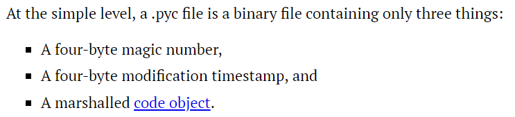

# pytte1337en

**Category**: rev  
**Challenge Author**: @larsh  
**Solvers**: @mkg, @herkarl

### Description
Look a pyc-file! This should be easy, hold my soju. 

File: challenge.pyc

### Solution


#### TLDR:
Try `uncompyle6`. `pyc`-file is corrupted. Try to repare it. Realize it is written by hand in python bytecode. Analyze how it works. Realize it parses mathematical expressions to build a string and then executes it. Exploit it.

---

We are given a `pyc`-file as the description says. We are also given an ip where the file is running. Running it or connecting to the server doesn't yield anything. Interacting with it gives us what looks like a shell but exits after two lines.


Naturally, we try do decompile it with `uncompyle6`.

```
>> uncompyle6 challenge.pyc
# uncompyle6 version 3.3.4
# Python bytecode 2.7 (62211)
# Decompiled from: Python 2.7.15 |Anaconda, Inc.| (default, Nov 13 2018, 23:04:45)
# [GCC 7.3.0]
# Compiled at: 2018-12-22 21:32:55
Traceback (most recent call last):
  File "/home/mkg/miniconda2/bin/uncompyle6", line 10, in <module>
    sys.exit(main_bin())
  File "/home/mkg/miniconda2/lib/python2.7/site-packages/uncompyle6/bin/uncompile.py", line 183, in main_bin
    **options)
  File "/home/mkg/miniconda2/lib/python2.7/site-packages/uncompyle6/main.py", line 250, in main
    source_encoding, linemap_stream, do_fragments)
  File "/home/mkg/miniconda2/lib/python2.7/site-packages/uncompyle6/main.py", line 165, in decompile_file
    mapstream=mapstream, do_fragments=do_fragments)]
  File "/home/mkg/miniconda2/lib/python2.7/site-packages/uncompyle6/main.py", line 117, in decompile
    is_pypy=is_pypy)
  File "/home/mkg/miniconda2/lib/python2.7/site-packages/uncompyle6/semantics/pysource.py", line 2304, in code_deparse
    show_asm=debug_opts['asm'])
  File "/home/mkg/miniconda2/lib/python2.7/site-packages/uncompyle6/scanners/scanner2.py", line 173, in ingest
    bytecode = self.build_instructions(co)
  File "/home/mkg/miniconda2/lib/python2.7/site-packages/uncompyle6/scanner.py", line 107, in build_instructions
    self.insts = self.remove_extended_args(list(bytecode))
  File "/home/mkg/miniconda2/lib/python2.7/site-packages/xdis/bytecode.py", line 276, in get_instructions_bytes
    argval, argrepr = _get_const_info(arg, constants)
  File "/home/mkg/miniconda2/lib/python2.7/site-packages/xdis/bytecode.py", line 181, in _get_const_info
    argval = const_list[const_index]
IndexError: tuple index out of range
```

That doesn't work. :( So we google a bit about the `pyc`-file structure and find [this](https://nedbatchelder.com/blog/200804/the_structure_of_pyc_files.html) page.



When comparing with other `pyc`-files we generated, we didn't find anything obvious wrong with the magic header. Time to dig deeper. Let's extract the marshalled code object and try to disassemble it with the `dis` module:

```py
import marshal, dis

f = open("challenge.pyc", "rb")
f = f.read()[8:]
code = marshal.loads(f)
print code # <code object  at 0x7f0cd3667db0, file "", line -1>
	
dis.dis(code)
```
```
<code object  at 0x7f45f6a4b7b0, file "", line -1>
  0           0 JUMP_ABSOLUTE            6
              3 LOAD_CONST             255
Traceback (most recent call last):
  File "grej.py", line 8, in <module>
    dis.dis(code)
  File "/home/mkg/miniconda2/lib/python2.7/dis.py", line 43, in dis
    disassemble(x)
  File "/home/mkg/miniconda2/lib/python2.7/dis.py", line 95, in disassemble
    print '(' + repr(co.co_consts[oparg]) + ')',
IndexError: tuple index out of range
```

---
**Side Note:**
Python code objects are interesting and can be used to escape python sandbox jail ctf tasks.
```py
def f():
	print "hello"

print f.func_code # Get code object from function
functiontype = type(f)
help(functiontype)
'''
Help on class function in module __builtin__:

class function(object)
 |  function(code, globals[, name[, argdefs[, closure]]])
 |
 |  Create a function object from a code object and a dictionary.
 |  The optional name string overrides the name from the code object.
 |  The optional argdefs tuple specifies the default argument values.
 |  The optional closure tuple supplies the bindings for free variables.
...
'''
codetype = type(f.func_code)
help(codetype)
'''
Help on class code in module __builtin__:

class code(object)
 |  code(argcount, nlocals, stacksize, flags, codestring, constants, names,
 |        varnames, filename, name, firstlineno, lnotab[, freevars[, cellvars]])
 |
 |  Create a code object.  Not for the faint of heart.
...
'''

ff = functiontype(f.func_code, {}) # reconstructing function from code object
ff() # prints "hello"
```

**End of Side Note**

---

The code is trying to load a constant that doesn't exists. Only these consts exist: `print code.co_consts #(0, '>>> ', None, 1, 2, '', 256, '(', ')', 'x', '*', '+')` Since there is only one byte of `'\xff'` in the byte string, let's remove it and hope it fixes it.

```py
import marshal, dis

f = open("challenge.pyc", "rb")
f = f.read()[8:]
f = f.replace('\xff', '\x00')
code = marshal.loads(f)
	
dis.dis(code)
```
```
  0           0 JUMP_ABSOLUTE            6
              3 LOAD_CONST               0 (0)
        >>    6 LOAD_CONST               0 (0)
        >>    9 SETUP_EXCEPT            23 (to 35)
        >>   12 LOAD_NAME                0 (raw_input)
             15 LOAD_CONST               1 ('>>> ')
             18 CALL_FUNCTION            1
             21 SETUP_LOOP               3 (to 27)
             24 JUMP_ABSOLUTE           53
        >>   27 LOAD_CONST               2 (None)
             30 DUP_TOP
             31 EXEC_STMT
             32 JUMP_ABSOLUTE           12
        >>   35 POP_TOP
             36 POP_TOP
             37 POP_TOP
             38 LOAD_CONST               3 (1)
             41 BINARY_ADD
             42 DUP_TOP
             43 LOAD_CONST               4 (2)
             46 COMPARE_OP               0 (<)
             49 POP_JUMP_IF_TRUE         9
             52 RETURN_VALUE
        >>   53 LOAD_CONST               5 ('')
             56 LOAD_CONST               0 (0)
             59 JUMP_ABSOLUTE           77
        >>   62 LOAD_NAME                1 (chr)
             65 ROT_TWO
             66 CALL_FUNCTION            1
             69 BINARY_ADD
             70 LOAD_FAST                0
Traceback (most recent call last):
  File "grej.py", line 8, in <module>
    dis.dis(code)
  File "/home/mkg/miniconda2/lib/python2.7/dis.py", line 43, in dis
    disassemble(x)
  File "/home/mkg/miniconda2/lib/python2.7/dis.py", line 101, in disassemble
    print '(' + co.co_varnames[oparg] + ')',
IndexError: tuple index out of range
```

We got further now. The first `LOAD_CONST` we changed seems to be jumped over and was only an anti-debugging trick. By looking at the docs for [`dis`](https://docs.python.org/2/library/dis.html) we see that `LOAD_FAST` tries to `Pushes a reference to the local co_varnames[var_num] onto the stack.`. But `co_varnames` is empty.

```py
print code.co_varnames # ()
```

Let's reconstruct the code object with a varname.

```py
import marshal, dis

f = open("challenge.pyc", "rb")
f = f.read()[8:]
f = f.replace('\xff', '\x00')
code = marshal.loads(f)

codetype = type(code)
newcode = codetype(code.co_argcount, code.co_nlocals, code.co_stacksize, code.co_stacksize, code.co_code, code.co_consts, code.co_names, ("var",), code.co_filename, code.co_name, code.co_firstlineno, code.co_lnotab)

dis.dis(newcode)
```
```
  0           0 JUMP_ABSOLUTE            6
              3 LOAD_CONST               0 (0)
        >>    6 LOAD_CONST               0 (0)
        >>    9 SETUP_EXCEPT            23 (to 35)
        >>   12 LOAD_NAME                0 (raw_input)
             15 LOAD_CONST               1 ('>>> ')
             18 CALL_FUNCTION            1
             21 SETUP_LOOP               3 (to 27)
             24 JUMP_ABSOLUTE           53
        >>   27 LOAD_CONST               2 (None)
             30 DUP_TOP
             31 EXEC_STMT
             32 JUMP_ABSOLUTE           12
        >>   35 POP_TOP
             36 POP_TOP
             37 POP_TOP
             38 LOAD_CONST               3 (1)
             41 BINARY_ADD
             42 DUP_TOP
             43 LOAD_CONST               4 (2)
             46 COMPARE_OP               0 (<)
             49 POP_JUMP_IF_TRUE         9
             52 RETURN_VALUE
        >>   53 LOAD_CONST               5 ('')
             56 LOAD_CONST               0 (0)
             59 JUMP_ABSOLUTE           77
        >>   62 LOAD_NAME                1 (chr)
             65 ROT_TWO
             66 CALL_FUNCTION            1
             69 BINARY_ADD
             70 LOAD_FAST                0 (var)
             73 LOAD_CONST               3 (1)
             76 BINARY_ADD
        >>   77 STORE_FAST               0 (var)
             80 DUP_TOPX                 2
                .                        .
                .                        .
                .                        .
                .                        .
```

Now we get the full disassembly. Another approach which we also tried was to make a local copy of the `dis` module and add a try/except block around the part that throws an exception.

```py
# Local dis.py
# ...
        try:
            if op >= HAVE_ARGUMENT:
                oparg = ord(code[i]) + ord(code[i+1])*256 + extended_arg
                extended_arg = 0
                i = i+2
                if op == EXTENDED_ARG:
                    extended_arg = oparg*65536L
                print repr(oparg).rjust(5),
                if op in hasconst:
                    print '(' + repr(co.co_consts[oparg]) + ')',
                elif op in hasname:
                    print '(' + co.co_names[oparg] + ')',
                elif op in hasjrel:
                    print '(to ' + repr(i + oparg) + ')',
                elif op in haslocal:
                    print '(' + co.co_varnames[oparg] + ')',
                elif op in hascompare:
                    print '(' + cmp_op[oparg] + ')',
                elif op in hasfree:
                    if free is None:
                        free = co.co_cellvars + co.co_freevars
                    print '(' + free[oparg] + ')',
        except Exception as e:
            print "INDEX ERROR"
# ...
```

At this point we realized that this code wasn't generated from normal python code. But built by hand. So to understand what it does we had to dig down and read up on python bytecode. The [`dis`](https://docs.python.org/2/library/dis.html) module has documentation of every instruction. We found some of the behaviour of the instructions confusing and it didn't feel apparent which instructions popped the stack or didn't. For instance: `BINARY_ADD() Implements TOS = TOS1 + TOS.` where `TOS` is Top-Of-Stack. I realize now that it does say higher up on the page that it does pop both `TOS` and `TOS1` before pushing the result.

Instead, during the competition, we found a link to the specific switch case in the `CPython` source code on github which interprets the different instructions. [Source](https://github.com/python/cpython/blob/2.7/Python/ceval.c). This was a great resource when reading the disassembly.

Looking at the disassembly we find function calls to `raw_input('>>> ')`, `char` and `int`. We also find an instruction called `EXEC_STMT` which is used to invoke the `exec` statement in python. We can see a path to a solution here. Somehow construct a string with code and pass it to `EXEC_STMT` on the remote instance to then read the flag file.

We realized that we could hook the function calls by constructing a function from the code object using custom globals. This was very useful when understanding what the program did and when we wanted to debug stuff.

```py
import marshal

f = open("challenge.pyc", "rb")
f = f.read()[8:]
code = marshal.loads(f)

def f():
    pass
functype = type(f)

def our_raw_input(s):
    print "RAW INPUT:", s
    return raw_input()
def our_chr(n):
    print "CHR:", chr(n)
    return chr(n)
def our_int(s):
    print "INT:", s
    return int(s)
ourglobals = {"raw_input": our_raw_input, "chr": our_chr, "int": our_int}

func = functype(code, ourglobals)
print "RETURN VALUE:", repr(func())
```


Yeah... It inf-loops on the input `3`. We will understand that later.

After reading through the disassembly several times and running it by hand using pen and paper (that is, a text editor) we realized that the program was parsing mathematical expressions containing parentheses, addition, multiplication, single digit integers, and some variable called `x`. So a valid input to the program would be `(4+5+x)*2*x`, `x+1` or `5`. After having evaluated the expression (let's call the result `theResult`), the program appended `chr(theResult)` to a global string and then started over, evaluating the same expression again. If `theResult` of the evaluation became congruent with `0` mod `257` it didn't append to the global string but it instead called `exec` on the global string and stopped.

So, if it keeps evaluating the same expression over and over again, how do we get it to different results? Either we make the expression evaluate to `0` mod `257` or we make it evaluate to something else. Hmmmm... Right! The mysterious variable `x`. It turns out that it corresponds to the current length of the global string. So it will start out as `0` then `1` and so on, increasing consecutively.

Here is pseudo code (python) of what the program does so far:

```python
cmd = ""
expr = raw_input('>>> ')
while True:
    val = evaluate(expr, x=len(cmd)) % 257
    if not val:
        break
    cmd += chr(val)
exec cmd
```

After a little thinking we now get a new interpretation of the problem and the program: Given a polynomial modulo `257` it will evaluate it at consecutive integers starting at `x = 0`. If the polynomial ever evaluates to `0`, `exec` the string constructed by the integer sequence generated by the polynomial up until this point. Wow.

Given a string we want to `exec` we can find the associated polynomial by solving a modular linear equation system. This can be done in easily with sagemath. We then want to write out the coefficients as expressions of single digits, addition and multiplication. The simplest way of doing this is just to sum up `1`'s a bunch of times. Here is our polynomial generator:

```python
g = "print(open('flag.txt').read)\0"

n = len(g)
mod = 257

M = [[i**p for p in range(n)] for i in range(n)]
b = Matrix(GF(mod), list(map(ord, g))).transpose()
A = Matrix(GF(mod), M)
res = list(map(int, list(A.solve_right(b).transpose()[0])))

def to_poly(c):
  d = len(c)
  p = ""
  for i in range(d):
    if i == 0:
      p += str(c[i])
    else:
      p += '+' + str(c[i]) + "*x"*i
  return p


def decompose(c):
  return '('+ '+'.join(['1']*c) + ')'

print to_poly(list(map(decompose,res)))
```

If we run the local hooked version of challenge.pyc with the polynomial for `print(open('flag.txt').read)` we get the following after suppressing the output for `int` and adding an accumulating string for the command. (For some reason I'm not sure of while writing this it doesn't work with the hooked version, but it does work with the original challenge.pyc. I think this has something to do with our hooked globals.)


Running it against the remote yields the flag: `midnight{pyc_is_not_just_to_uncompyle}`
